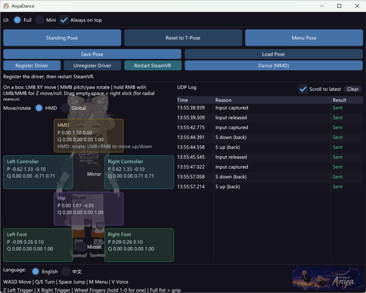
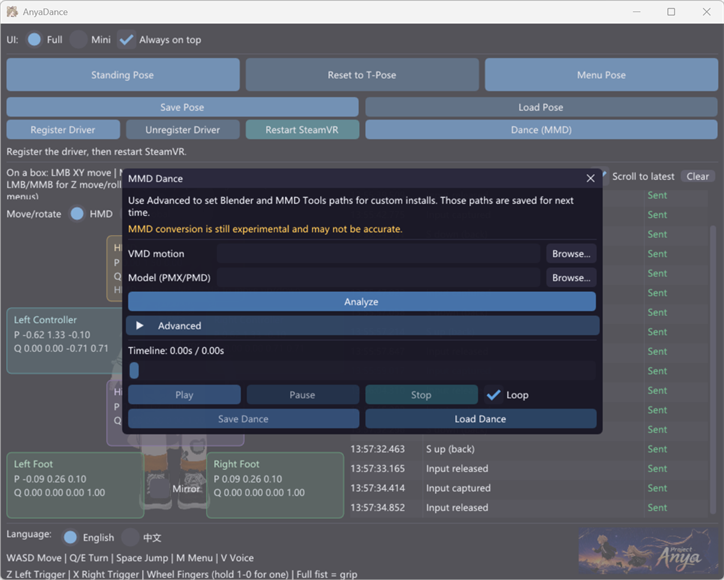

# AnyaDance

<p>
  
</p>

**English** | [简体中文](README.zh-CN.md)

AnyaDance is a Windows toolkit for driving and animating a VRChat avatar's full body — pose it by hand, drive it live, or play an MMD dance on it. At its core is a SteamVR/OpenVR virtual-device driver plus a companion UI (`AnyaDance.exe`) that streams to it. The driver exposes six virtual devices for VRChat full-body testing:

- HMD
- left controller
- right controller
- hip tracker
- left foot tracker
- right foot tracker

The driver receives pose and controller-input frames over UDP JSON on `127.0.0.1:39570`. The companion executable, `AnyaDance.exe`, starts streaming a six-device T-pose at 60 Hz as soon as it opens.

AnyaDance is released as part of **Project Anya**, a larger project by Pipira. Project Anya itself is proprietary. Crediting Project Anya when you use or build on this driver is highly appreciated.

## Disclaimer

This software is provided for legitimate, authorized testing and development only.

Feeding virtual devices or spoofed tracking into a live online game may violate that game's Terms of Service and can be detected by its anti-cheat system, which may result in the suspension or permanent ban of your account.

Registering the driver changes your SteamVR configuration: it activates AnyaDance's fully virtual HMD, controllers, and trackers and writes to `steamvr.vrsettings`. Registration creates a backup, and unregistering restores the original configuration. The virtual HMD continuously renders both eyes through the SteamVR compositor, which consumes additional GPU and CPU; raising the render resolution increases that load further.

You use this software entirely at your own risk. It is provided "as is" without warranty of any kind, and the authors accept no responsibility or liability for any consequences of use or misuse, including account bans or loss of access.

This project is not affiliated with or endorsed by VRChat, Valve, Steam, or SteamVR. All trademarks belong to their respective owners.

See [DISCLAIMER.md](DISCLAIMER.md) for the full text. This is a safety acknowledgment, not an additional license condition. The companion UI asks you to acknowledge it on first launch.

## Status

The code builds and its automated tests pass on Windows with Visual Studio 2022. The shipped tool registers the SteamVR driver, streams six virtual devices, and packages the driver bundle from the same build.

## Requirements

- Windows 10 or newer
- SteamVR installed
- [Microsoft Visual C++ Redistributable for Visual Studio 2015-2022 (x64)](https://aka.ms/vc14/vc_redist.x64.exe)

Building from source additionally requires:

- Visual Studio 2022 or Visual Studio Build Tools with Desktop development with C++
- CMake 3.22 or newer
- Network access for the default first build, unless local dependency paths are supplied

Pinned dependencies:

- Valve OpenVR SDK `2.2.3`
- Dear ImGui `v1.90.9`

## Install A Release

1. Download `AnyaDance-<version>-windows-x64.zip` from the [GitHub Releases](https://github.com/anyapipira/AnyaDance/releases) page.
2. Extract the complete `anyadance` folder to a permanent location. Do not run the executable from inside the ZIP, and do not move or delete the folder while its driver is registered.
3. Run `AnyaDance.exe`, review and acknowledge the safety notice, then click **Register Driver**.
4. Click **Restart SteamVR**. SteamVR will start in fully virtual mode with the AnyaDance HMD, controllers, and trackers.

When finished, click **Unregister Driver** and restart SteamVR before moving or deleting the folder. This restores the SteamVR settings backup and returns SteamVR to real-device tracking. See [Installation](docs/installation.md) for details.

## Build

```powershell
.\scripts\build_driver.ps1
```

Outputs:

```text
build\out\anyadance\AnyaDance.exe
build\out\anyadance\driver.vrdrivermanifest
build\out\anyadance\bin\win64\driver_anyadance.dll
build\out\anyadance\resources\...
build\out\anyadance\LICENSE
build\out\anyadance\NOTICE
build\out\anyadance\THIRD_PARTY_NOTICES.md
build\out\anyadance\DISCLAIMER.md
build\out\anyadance\TRADEMARKS.md
build\out\anyadance\README.md
build\out\anyadance\README.zh-CN.md
build\out\AnyaDance.zip
```

The UI ships inside the driver folder, so `build\out\anyadance\` is one
shippable bundle with the license/notices, and the build also zips it into
`build\out\AnyaDance.zip` to hand to others directly. The exe registers its own folder as the SteamVR
driver, so OpenVR finds `driver.vrdrivermanifest` and `bin\win64\driver_anyadance.dll`
beside it. OpenVR loads the driver DLL from `bin\win64\`, with the manifest at
the driver root.

To use local dependency checkouts:

```powershell
.\scripts\build_driver.ps1 -OpenVRSdkRoot F:\deps\openvr -ImguiRoot F:\deps\imgui
```

## Test

```powershell
cmake --build build --config Release --target anyadance_tests
ctest --test-dir build -C Release --output-on-failure
```

The tests cover protocol validation, safety clamping, T-pose reset math, keyboard controls, mouse manipulation math, MMD remapping, `.nya` clip handling, and UDP log behavior.

## Register

```powershell
.\scripts\register_driver.ps1
.\scripts\restart_steamvr.ps1
```

`register_driver.ps1` registers the driver and applies the fully virtual settings (virtual HMD, controllers, and trackers enabled), backing up `steamvr.vrsettings` to `%LOCALAPPDATA%\AnyaDance\steamvr.vrsettings.backup` first.

SteamVR must be restarted after registration changes and after rebuilding the driver DLL.

> **Unregister when you are done.** Registration activates AnyaDance's fully virtual device set. See [Unregister](#unregister) to restore your original SteamVR settings.

## HMD Render Resolution

The virtual HMD renders at `1920x1080` per eye by default, which keeps the SteamVR compositor's load modest. Advanced users can raise it without rebuilding the driver by overriding two settings keys.

Edit the global `steamvr.vrsettings` (at `<Steam>\config\steamvr.vrsettings`) and add or extend the `driver_anyadance` section:

```json
"driver_anyadance": {
    "headset_render_width": 3840,
    "headset_render_height": 2160
}
```

Then restart SteamVR (`.\scripts\restart_steamvr.ps1`). `3840x2160` is 4K. Any aspect ratio works (for example, match your monitor's) — the projection adapts to the configured render resolution, so the image is not stretched. Higher resolutions cost roughly the square of the scale in GPU render time — 4K is about four times 1080p.

Values set in `steamvr.vrsettings` win over the driver defaults in `resources\settings\default.vrsettings`. The same section also exposes `headset_window_width`, `headset_window_height`, `headset_window_eye_mode`, and `headset_window_preserve_aspect` for the desktop mirror window; see [docs/device-model.md](docs/device-model.md).

The driver also reports processed UDP commands over a loopback-only multicast
group by default. The group and port are configurable in the same section:

```json
"driver_anyadance": {
    "command_log_enabled": true,
    "command_log_multicast_group": "239.255.39.71",
    "command_log_port": 39571
}
```

The UI's **Monitor driver commands** switch starts off and remembers your choice across launches. It joins or leaves the default group immediately. Multiple local applications can subscribe simultaneously. Run `.\scripts\listen_driver_log.ps1` for a reference listener, or add `-Validate -ListenerCount 3` to verify three independent receiver processes. See [docs/protocol.md](docs/protocol.md#driver-command-logging) for the packet schema and delivery behavior.

## Run The Test UI

```powershell
.\build\out\anyadance\AnyaDance.exe
```

The UI:

- starts 60 Hz UDP streaming automatically
- continues streaming while minimized or unfocused
- sends a final neutral-input frame on normal exit
- keeps the UDP log in English and can hot-toggle driver command monitoring; while monitoring is active, driver processing reports show commands from the UI and third-party UDP senders without duplicate successful-send rows
- shows hover or pinned row detail with three payload actions: Copy (the raw request body), Copy resend command (a runnable PowerShell UDP one-liner), and Resend (replays the exact datagram from the UI over its own socket)
- can register/unregister its own folder as the SteamVR driver and restart SteamVR (with a confirmation) from its own buttons
- has an Always on top checkbox that pins the window above other windows; the choice is remembered between runs
- can play an MMD dance on the fly: the **Dance (MMD)** button opens a dialog to pick a `.vmd` motion and a `.pmx`/`.pmd` model, then Analyze and Play stream the dance onto the six devices (see [docs/mmd-dance.md](docs/mmd-dance.md))
- can save and restore poses and dances as `.nya` clips: **Save Pose** / **Load Pose** in the main window capture and restore the current pose, and the Dance dialog can **Save .nya** of an analyzed dance and **Load .nya** to play it again without re-solving
- supports English and Simplified Chinese UI strings through `src/ui/localization.*`

Key bindings:

```text
WASD  left joystick movement
Q/E   right joystick turn
Space right A while held
M     right B while held
V     left A while held
Z     left trigger while held
X     right trigger while held
```

Mouse manipulation uses the six device boxes. The capture panel and boxes resize with the UI window. The HMD box allows rotation, plus vertical (Y) movement with a right mouse drag; a left+right chord provides the same vertical gesture. Other devices use left mouse drag for local X/Y movement, middle mouse drag for rotation, and right mouse drag for depth movement. Device Y is capped at `25 m`, and only the HMD has a floor at `0 m`; the other five devices may go below the ground plane down to `-30 m`. The HMD/Global frame radio buttons choose whether manipulation uses the HMD yaw basis or fixed world axes. The hand and foot pair mirror checkboxes use the same frame setting: HMD mode mirrors across the HMD-yaw YZ plane, and Global mode mirrors across world axes centered on the HMD position. The mouse wheel opens and closes both hands' fingers. Hold a number key while scrolling to bend a single finger: `1`-`5` are the left hand from pinky to thumb, `6`-`0` are the right hand from thumb to pinky (so `5`/`6` are the thumbs and `1`/`0` the pinkies). Each finger is clamped to `[0, 1]`, and scrolling all the way in one direction resets every finger to fully open or fully closed. Closing every finger on a hand into a fist (all bends near full) presses that hand's grip; releasing any finger releases it, which drives VRChat's grab.

Dragging the empty area of the body panel acts as the right thumbstick: the press point is the stick center, and dragging deflects it within ±1 on each axis, returning to neutral on release. This is meant for navigating the right-hand quick menu (opened by holding `M`). The empty area also manipulates the whole rig at once: a middle mouse drag rotates all six devices (yaw/pitch) about the HMD position, a middle+right drag rolls them about the same pivot, and a right mouse drag moves the whole rig vertically while preserving its shape, stopping on the way down when the HMD reaches `0 m`. Rig rotation uses the same HMD/Global frame setting as the per-device gestures.

## MMD Dance

<p>
  
</p>

The **Dance (MMD)** button plays an MMD dance on the six virtual devices live in
memory. Blender + MMD Tools solves the `.vmd` motion against a model you supply
(PMX/PMD), and the UI does a small remapping onto the hardcoded rig and streams
it at 60 Hz. Pick the VMD and model in the dialog, hit Analyze, then Play. Use
**Advanced** to set Blender and MMD Tools paths for custom installs; the UI
remembers those paths.

Requirements: [Blender](https://www.blender.org/) and the
[MMD Tools](https://github.com/MMD-Blender/blender_mmd_tools) add-on (both
auto-detected), plus your own model. MMD models are third-party works with their
own licenses. See [docs/mmd-dance.md](docs/mmd-dance.md) for details, parameters,
and runtime behavior.

Once a dance is analyzed, **Save .nya** writes the result to a clip file. **Load
.nya** reads one back and enables Play immediately — loading skips both the
Blender solve and the remap, so a saved dance plays instantly.

## Clip files (.nya)

A `.nya` file is a small JSON clip of device-level frames — the six device poses
plus per-hand finger bends — ready to stream with no further conversion. The
format is the same for poses and animations: a **pose** is a one-frame clip
(played as a held loop of that single frame) and an **animation** (such as a
saved MMD dance) is many timed frames. Loading clamps device Y to `0–25 m` for
the HMD and `-30–25 m` for the other five devices, and finger bends to `[0, 1]`.

## Safety And Liveness

All six devices share a `25 m` Y ceiling. Only the HMD has a floor, at `0 m` — it is the play-space head, so putting it below the ground plane puts the view underground. The other five devices legitimately go below it (a foot passing under the floor plane, a hip in a floor move) and are bounded only by the shared `±30 m` position range. The UI clamps before serialization and the native driver clamps again after packet validation.

All six devices start connected and valid at neutral poses. Accepted packets update the latest pose and controller inputs. If packets stop, SteamVR continues to see each device connected, valid, and `TrackingResult_Running_OK` at its last accepted pose.

## Protocol Overview

- UDP to `127.0.0.1:39570`
- UTF-8 JSON
- `version` must be `1`
- fire-and-forget datagrams
- accepted datagrams are smaller than 8192 bytes
- quaternion order is XYZW
- recognized device IDs are `hmd`, `left_controller`, `right_controller`, `hip`, `left_foot`, `right_foot`

See [docs/protocol.md](docs/protocol.md) for the full protocol.

## Unregister

```powershell
.\scripts\uninstall.ps1
```

**Unregistering restores the original SteamVR configuration.** While registered, SteamVR uses the six-device AnyaDance virtual rig. Unregistering restores the settings backup created during registration.

`uninstall.ps1` saves a recovery snapshot, removes the driver entry, restores `steamvr.vrsettings` from the registration backup when available, verifies removal, restarts SteamVR, and leaves the AnyaDance application files in place.

You can also unregister from within the UI using the **Unregister Driver** button, which uses the same recovery files and prompts to restart SteamVR.

## Uninstall

1. **Unregister the driver** (see [Unregister](#unregister) above) and restart SteamVR so real devices are restored.
2. Delete the AnyaDance folder you extracted.
3. Optionally delete the UI's saved state from AppData:
   - `%LOCALAPPDATA%\AnyaDance\ui_state.ini` — saved preferences (window size, paths, always-on-top, etc.)
   - `%LOCALAPPDATA%\AnyaDance\steamvr.vrsettings.backup` — the SteamVR settings backup made during registration (removed automatically on unregister)
   - `%LOCALAPPDATA%\AnyaDance\registered_driver_path.txt` — the path recorded at registration so unregister can find the bundle even if it moved (removed automatically on unregister)

If you skip step 1 before deleting the folder, SteamVR will still reference the (now missing) driver path. Run `uninstall.ps1` from a copy of the scripts folder, or remove the driver entry manually from `%LOCALAPPDATA%\openvr\openvrpaths.vrpath`.

## License

AnyaDance is open source, licensed under the Apache License, Version 2.0.

Licensed under the Apache License, Version 2.0. See [LICENSE](LICENSE) and the
[NOTICE](NOTICE) attribution file. Redistributions must preserve the NOTICE
contents and mark any modified files. Bundled third-party components keep their
own licenses; see [THIRD_PARTY_NOTICES.md](THIRD_PARTY_NOTICES.md).

Media ownership, licensing, and the separate terms that apply to the EmoteLab
dance GIF are documented in [ASSETS.md](ASSETS.md).

See [TRADEMARKS.md](TRADEMARKS.md) for the AnyaDance and Project Anya branding
notice.


